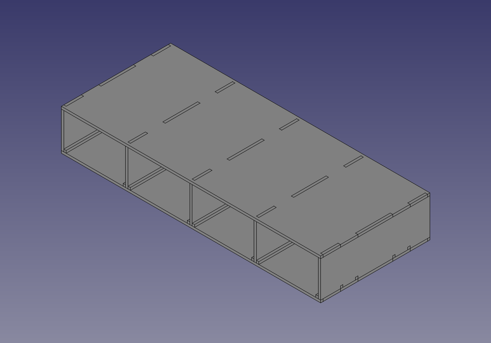
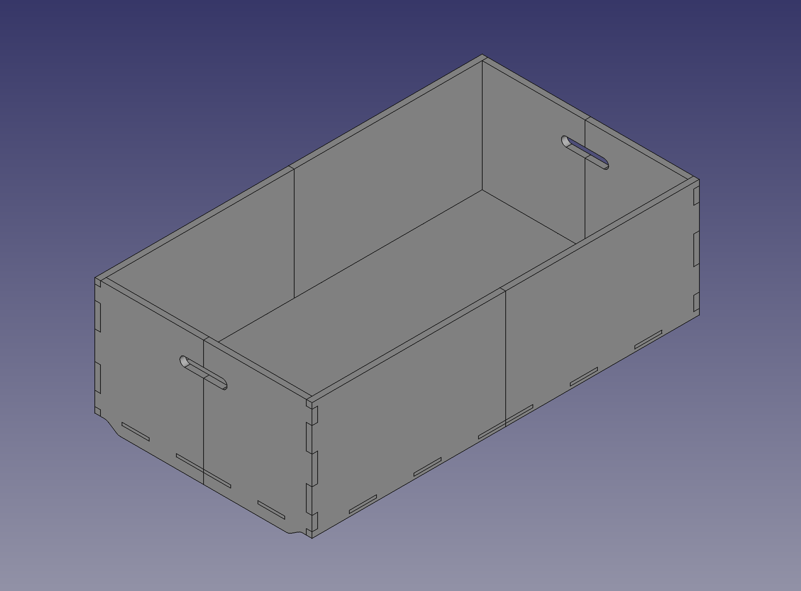

# Work In Progress
These drawers are still under development and have a few bugs to iron out before they're ready to go, so please be ware..

# Bunk Drawers
Set of bunk bed drawers for storage under the bed. The bunk bed this is designed for is also custom made so adjustements must be done in the spreadsheet of the FreeCad file to fit under your bunks.

Heavily inspired by and designed based on the [Hat-Systems](https://github.com/fellesverkstedet/hat-systems) by the lovely people at Fellesverksteded. 

# License
Like it's cousin, the Bunk Drawers are distributed under Creative Commons Attribution 4.0 International. [CC-BY 4.0](http://creativecommons.org/licenses/by/4.0/).

# Design changes
Since this drawer set is not required to be nearly as steardy as the original and I wanted to maximize the storage space, I've chosen to only have one vertical divider piece between drawers. This required me to add two variations of the vertical pieces and sliders.

# Preview
Bunk Drawers Frame

Bunk Drawer

Assembled

